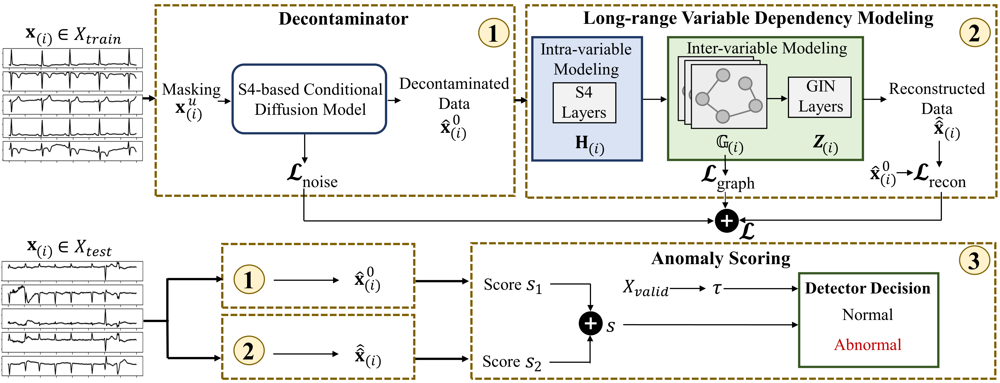

# Contaminated Multivariate Time-Series Anomaly Detection with Spatio-Temporal Graph Conditional Diffusion Models

This repository contains the official implementation of the paper:

**Contaminated Multivariate Time-Series Anomaly Detection with Spatio-Temporal Graph Conditional Diffusion Models**  
Accepted to the 41st Conference on Uncertainty in Artificial Intelligence (UAI 2025)

## Abstract
Mainstream unsupervised anomaly detection algorithms often excel in academic datasets, yet their real-world performance is restricted due to the controlled experimental conditions involving clean training data. Addressing the challenge of training with noise, a prevalent issue in practical anomaly detection, is frequently overlooked. In a pioneering endeavor, this study delves into the realm of label-level noise within sensory time-series anomaly detection (TSAD). This paper presents a novel and practical end-to-end unsupervised TSAD when the training data is contaminated with anomalies. The introduced approach, called TSAD-C, is devoid of access to abnormality labels during the training phase. TSAD-C encompasses three core modules: a Decontaminator to rectify anomalies (aka noise) present during training, a Long-range Variable Dependency Modeling module to capture long-term intra- and inter-variable dependencies within the decontaminated data that is considered as a surrogate of the pure normal data, and an Anomaly Scoring module to detect anomalies from all types. Our extensive experiments conducted on four reliable and diverse datasets conclusively demonstrate that TSAD-C surpasses existing methodologies, thus establishing a new state-of-the-art in the TSAD field.


<p align="center"></p>

## 📁 Repository Structure
```
├── data/                   # Datasets 
├── model/                  # Core model implementation
├── utils/                  # Utility functions
├── main_run.py             # Training and evaluation pipeline
├── args.py                 # Experiment configurations
└── README.md
```

## Requirements
- Python 3.9+
- PyTorch >= 1.12
- DGL or PyTorch Geometric

## Running the code
Download the [SMD](https://github.com/NetManAIOps/OmniAnomaly), [ICBEB](https://github.com/helme/ecg_ptbxl_benchmarking), [DODH](https://github.com/Dreem-Organization/dreem-learning-open), and [TUSZ](https://isip.piconepress.com/projects/tuh_eeg/html/downloads.shtml) datasets and place them in the `data/` directory.

To train and evaluate the model, run the command:
```bash
python main_run.py 
```

## License
This project is licensed under the MIT License. See LICENSE for more details.

## Citation
If you use this code or find our work helpful, please cite:
```bibtex
@article{ho2023multivariate,
  title={Contaminated Multivariate Time-Series Anomaly Detection with Spatio-Temporal Graph Conditional Diffusion Models},
  author={Ho, Thi Kieu Khanh and Armanfard, Narges},
  journal={The 41st Conference on Uncertainty in Artificial Intelligence (UAI 2025)},
  year={2025}
}
```
